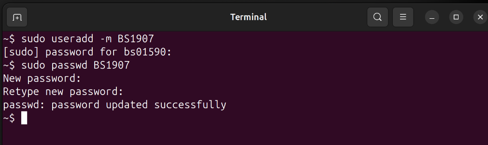
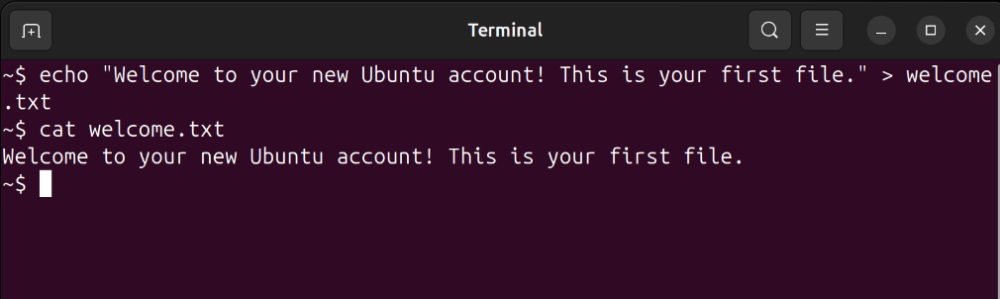
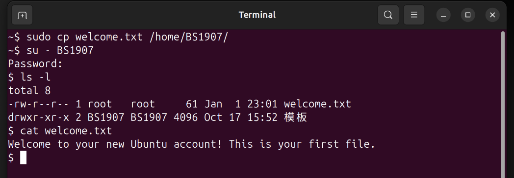

# Mini Project 1: User & File Basics

## Objective
Learn user management and file copying in Ubuntu.

## Solution

### Step 1: Create a New User
First, I created a new user with my BSID as the username:

```bash
sudo useradd -m BS1907
```

The `-m` flag creates a home directory for the new user automatically.

### Step 2: Set Password
Next, I set a password for the new user:

```bash
sudo passwd BS1907
```

The system prompted me to enter and confirm the password twice.

### Step 3: Create and Write to welcome.txt
From my regular user account, I created a file with a welcome message:

```bash
echo "Welcome to your new Ubuntu account! This is your first file." > welcome.txt
```

### Step 4: Copy File to New User's Home
I copied the file to the new user's home directory:

```bash
sudo cp welcome.txt /home/BS1907/
```

### Step 5: Verify as New User
I switched to the new user and verified the file exists:

```bash
su - BS1907
ls -l
cat welcome.txt
```

The file was successfully copied and accessible from the new user's account.

## Screenshots

### Creating User and Setting Password


### Creating welcome.txt File


### Copying File and Verification


## Key Concepts Learned
- `useradd`: Creates new user accounts
- `passwd`: Sets or changes user passwords
- `cp`: Copies files and directories
- `su`: Switches to another user account
