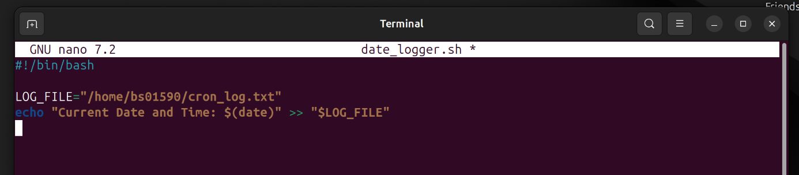
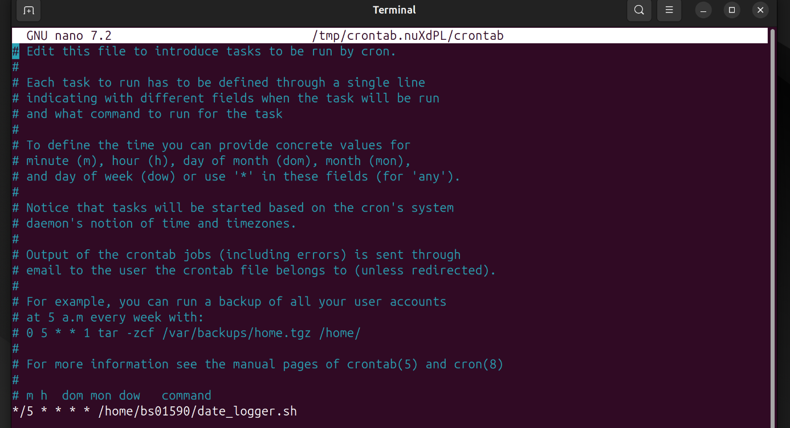
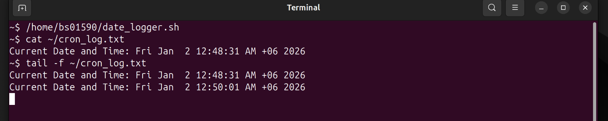

# Mini Project 10: Cron Job Automation

## Objective
Learn how to schedule automated tasks using cron.

## Solution

### Step 1: Create Date Logger Script
I created a script that logs the current date and time:

```bash
#!/bin/bash

LOG_FILE="$HOME/cron_log.txt"
echo "Current Date and Time: $(date)" >> "$LOG_FILE"
```

I saved this as `date_logger.sh` and made it executable:

```bash
chmod +x ~/date_logger.sh
```

### Step 2: Schedule with Cron
I edited the crontab to run the script every 5 minutes:

```bash
crontab -e
```

I added this line to the crontab:

```
*/5 * * * * /home/BS1907/date_logger.sh
```

The format is: `minute hour day month weekday command`
- `*/5` means every 5 minutes

### Step 3: Verify Cron Job is Running
I verified the cron job was scheduled:

```bash
crontab -l
```

This displayed the scheduled job.

### Step 4: Check Log File Updates
After waiting a few minutes, I checked if the log file was updating automatically:

```bash
cat ~/cron_log.txt
```

I could also watch it in real-time:

```bash
tail -f ~/cron_log.txt
```

The file showed new entries every 5 minutes, confirming the automation works correctly.

## Screenshots

### Creating the Logger Script


### Editing Crontab


### Checking Log Updates


## Key Concepts Learned
- `crontab`: Manages scheduled tasks for individual users
- Cron syntax: Five time fields (minute, hour, day, month, weekday)
- `*/5`: Runs every 5 minutes
- `>>`: Appends output to a file without overwriting
- Cron enables automated system maintenance and monitoring
- Scripts must be executable and use absolute paths in crontab

## Cron Time Syntax Reference
```
* * * * * command
│ │ │ │ │
│ │ │ │ └─── Day of week (0-7, Sun=0 or 7)
│ │ │ └───── Month (1-12)
│ │ └─────── Day of month (1-31)
│ └───────── Hour (0-23)
└─────────── Minute (0-59)
```
