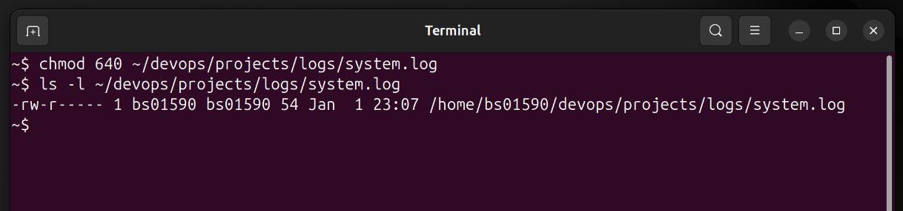
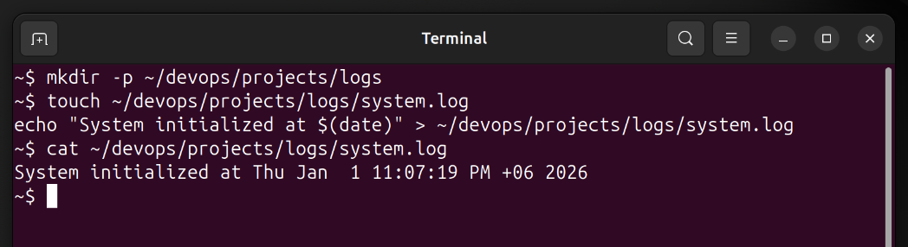

# Mini Project 2: Directory Structure & Permissions

## Objective
Understand Linux directory structures and file permissions.

## Solution

### Step 1: Create Directory Structure
I created the nested directory structure in my home directory:

```bash
mkdir -p ~/devops/projects/logs
```

The `-p` flag creates parent directories as needed, so all three levels are created in one command.

### Step 2: Create system.log File
Next, I created a log file inside the logs directory:

```bash
touch ~/devops/projects/logs/system.log
echo "System initialized at $(date)" > ~/devops/projects/logs/system.log
```

### Step 3: Set Permissions
I changed the file permissions according to the requirements:

```bash
chmod 640 ~/devops/projects/logs/system.log
```

This sets:
- Owner: read (4) + write (2) = 6
- Group: read (4) = 4
- Others: no access = 0

### Step 4: Verify Permissions
I verified the permissions were set correctly:

```bash
ls -l ~/devops/projects/logs/system.log
```

The output showed `-rw-r-----` which confirms the correct permissions.

## Screenshots

### Creating Directory Structure


### Setting & Verifying Permissions


## Key Concepts Learned
- `mkdir -p`: Creates nested directories in one command
- `chmod`: Changes file permissions using numeric notation
- Permission bits: read (4), write (2), execute (1)
- Permission format: owner-group-others
