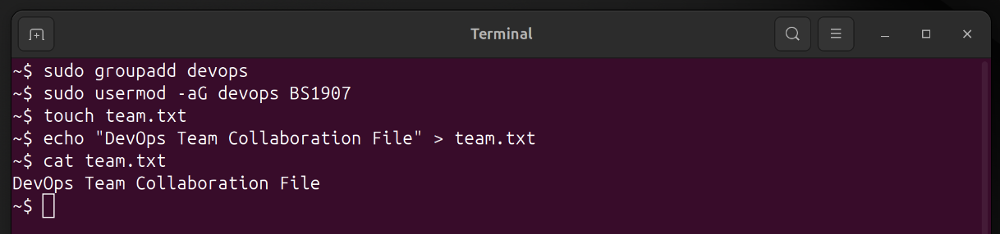
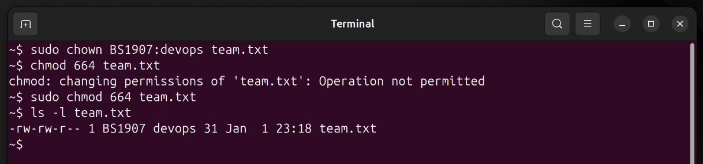

# Mini Project 3: Ownership & Groups

## Objective

Learn users, groups, and file ownership in Linux.


## Solution

### Step 1: Create `devops` Group

I created a new group named **devops**:

```bash
sudo groupadd devops
```

### Step 2: Add BSID User to Group

I added my BSID user (`BS1907`) to the `devops` group:

```bash
sudo usermod -aG devops BS1907
```

The `-aG` option appends the user to the group without removing existing group memberships.


### Step 3: Create `team.txt` File

I created a file named `team.txt` and added content to it:

```bash
echo "DevOps Team Collaboration File" > team.txt
```

### Step 4: Change File Ownership

I changed the file ownership so that:

* **Owner** → `BS1907`
* **Group** → `devops`

```bash
sudo chown BS1907:devops team.txt
```

### Step 5: Ensure Group Members Can Edit the File

Since the file is owned by `BS1907`, permission changes must be done using `sudo`:

```bash
sudo chmod 664 team.txt
```

This sets:

* Owner → read & write
* Group → read & write
* Others → read only

---

### Step 6: Verify Ownership and Permissions

I verified the ownership and permissions using:

```bash
ls -l team.txt
```

Expected output format:

```text
-rw-rw-r-- 1 BS1907 devops team.txt
```

## Screenshots

### Creating group and adding user


### Changing file ownership & Verify


## Key Concepts Learned

* `groupadd` → Create a new group
* `usermod -aG` → Add user to supplementary group
* `chown` → Change file owner and group
* `chmod` → Modify file permissions
* Group permissions enable collaborative file access