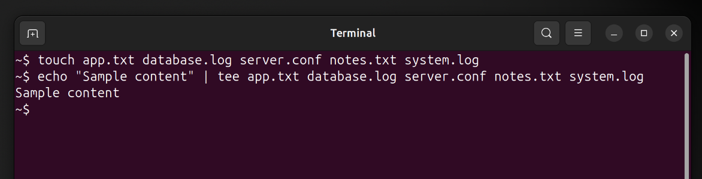
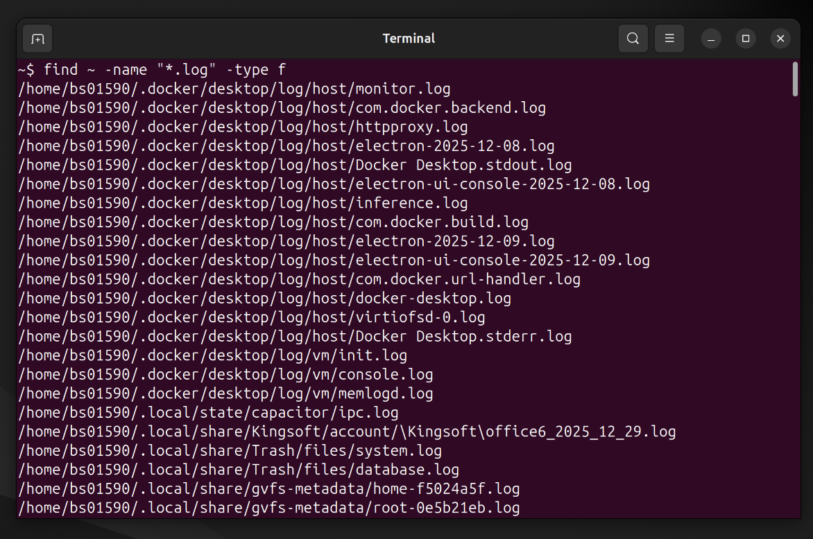
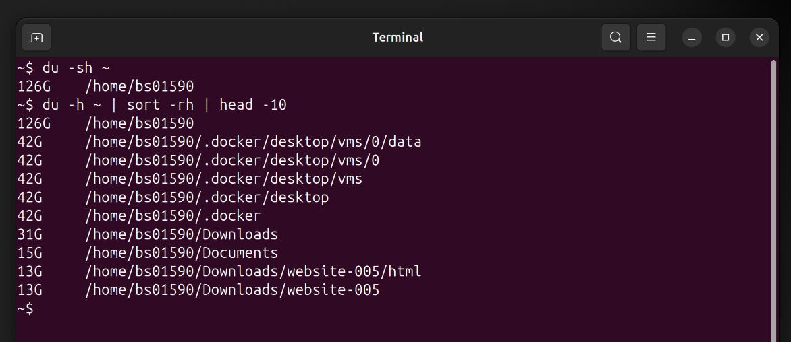
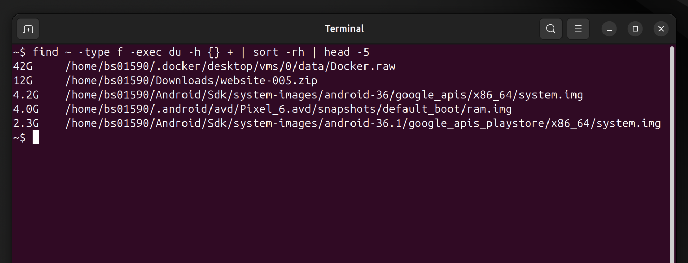

# Mini Project 4: File Search & Disk Usage

## Objective
Practice file searching and disk inspection commands.

## Solution

### Step 1: Create Files with Different Extensions
I created five files with various extensions:

```bash
touch app.txt database.log server.conf notes.txt system.log
echo "Sample content" | tee app.txt database.log server.conf notes.txt system.log
```

### Step 2: Find All .log Files
I searched for all log files in my home directory:

```bash
find ~ -name "*.log" -type f
```

This command found both `database.log` and `system.log` files.

### Step 3: Check Disk Usage
I checked the disk usage of my home directory:

```bash
du -sh ~
du -h ~ | sort -rh | head -10
```

The first command shows total size, while the second shows the largest subdirectories.

### Step 4: Identify Largest File
I found the largest file using:

```bash
find ~ -type f -exec du -h {} + | sort -rh | head -5
```

This lists the top 5 largest files in my home directory.

## Screenshots

### Creating Files


### Finding .log Files


### Checking Disk Usage


### Identifying Largest Files


## Key Concepts Learned
- `find`: Powerful search command with various options
- `du`: Shows disk usage of files and directories
- `df`: Displays filesystem disk space usage
- `-h` flag: Shows sizes in human-readable format (KB, MB, GB)
