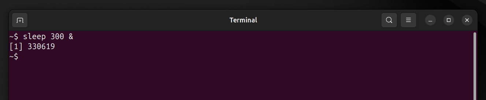
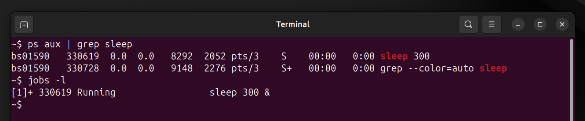
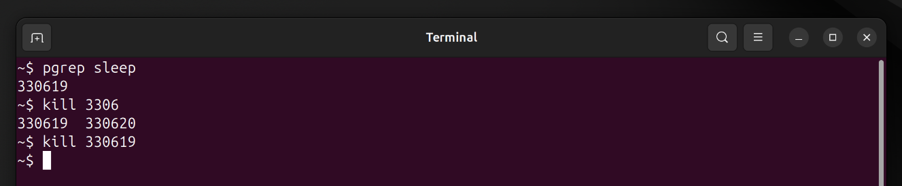
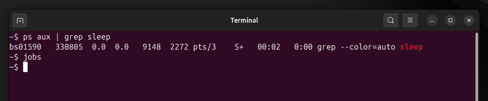

# Mini Project 5: Process Management

## Objective
Understand how to manage running processes in Linux.

## Solution

### Step 1: Start Background Process
I started a sleep process in the background:

```bash
sleep 300 &
```

The `&` symbol runs the command in the background and returns the job number and PID.

### Step 2: List Running Processes
I listed all running processes to see the sleep command:

```bash
ps aux | grep sleep
```

I also used the `jobs` command to see background jobs:

```bash
jobs -l
```

### Step 3: Identify Process ID
The PID was shown when I started the process, but I also confirmed it using:

```bash
pgrep sleep
```

### Step 4: Kill Process Gracefully
I terminated the process using SIGTERM (graceful shutdown):

```bash
kill <PID>
```

For a more forceful kill, I could have used `kill -9 <PID>`.

### Step 5: Confirm Process Stopped
I verified the process was terminated:

```bash
ps aux | grep sleep
jobs
```

The sleep process no longer appeared in the output.

## Screenshots

### Starting Background Process


### Listing Processes


### Killing Process


### Confirming Termination


## Key Concepts Learned
- `ps`: Shows process status
- `top`: Interactive process viewer
- `kill`: Sends signals to processes (default SIGTERM)
- `&`: Runs commands in background
- `jobs`: Lists background jobs in current shell
