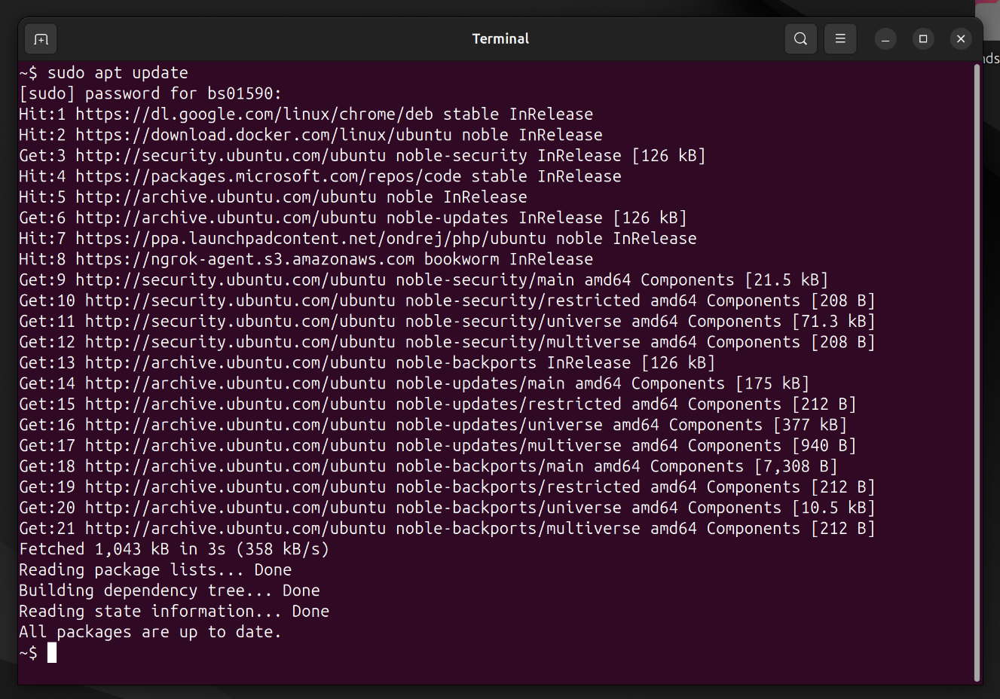
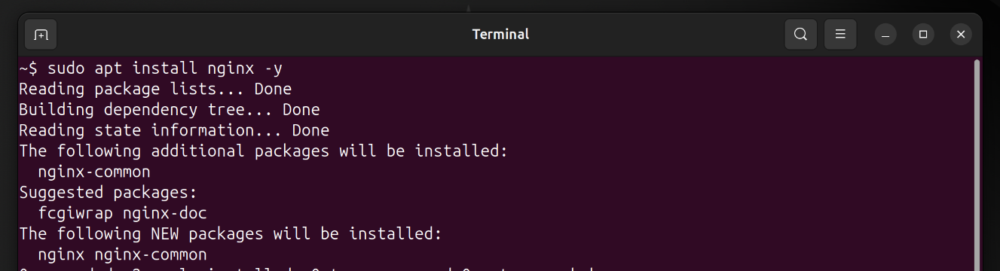
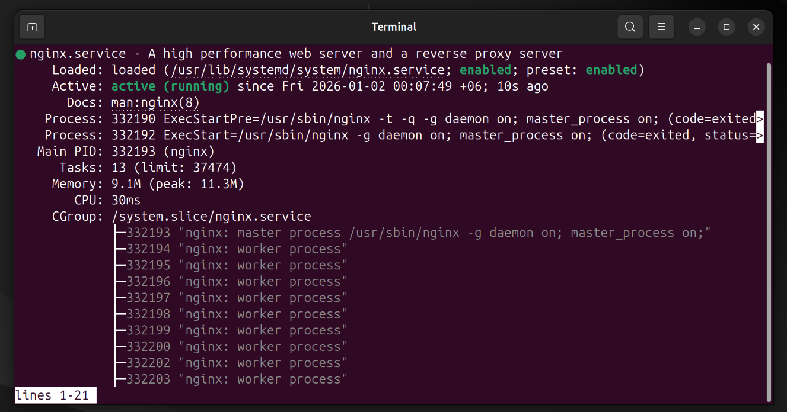
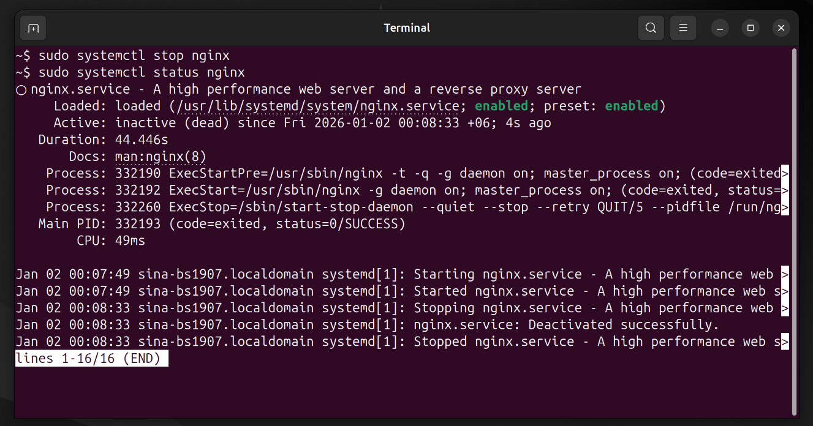
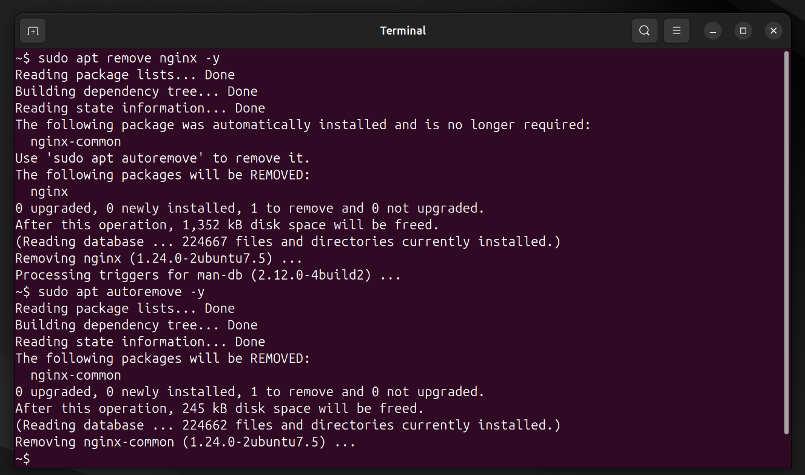

# Mini Project 6: Package Management

## Objective
Learn how to install and manage software packages on Ubuntu.

## Solution

### Step 1: Update Package Lists
First, I updated the package repository information:

```bash
sudo apt update
```

This downloads the latest package information from all configured sources.

### Step 2: Install nginx
I installed the nginx web server:

```bash
sudo apt install nginx -y
```

The `-y` flag automatically answers "yes" to prompts.

### Step 3: Check Service Status
I checked if nginx is running:

```bash
sudo systemctl status nginx
```

This showed that nginx was active and running.

### Step 4: Start and Stop Service
I practiced stopping and starting the service:

```bash
sudo systemctl stop nginx
sudo systemctl status nginx
sudo systemctl start nginx
sudo systemctl status nginx
```

### Step 5: Uninstall nginx
Finally, I removed nginx from the system:

```bash
sudo apt remove nginx -y
sudo apt autoremove -y
```

The autoremove command cleans up unused dependencies.

## Screenshots

### Updating Package Lists


### Installing nginx


### Checking Service Status


### Starting and Stopping Service


### Uninstalling nginx


## Key Concepts Learned
- `apt update`: Refreshes package repository information
- `apt install`: Installs software packages
- `systemctl`: Controls system services (systemd)
- `apt remove`: Uninstalls packages
- `apt autoremove`: Removes unused dependencies
