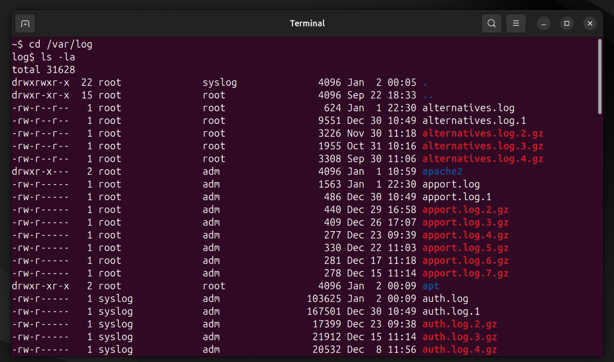
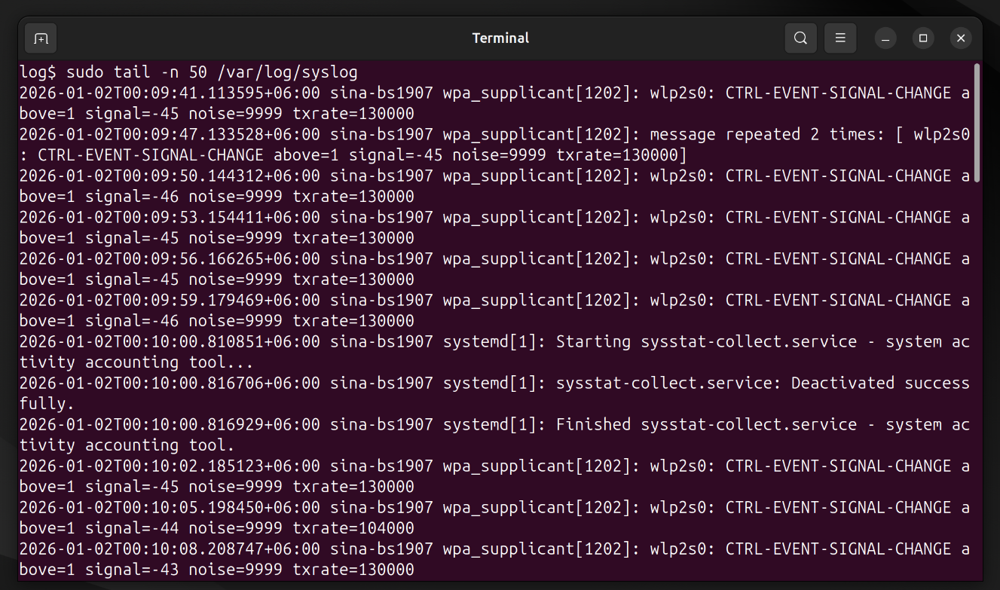
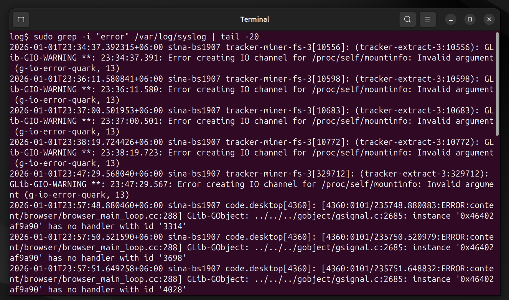
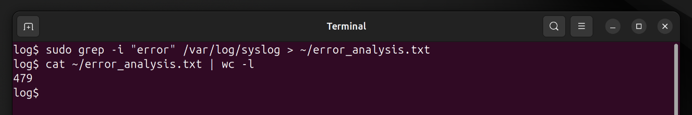

# Mini Project 7: Log File Analysis

## Objective
Learn basic troubleshooting by analyzing system logs.

## Solution

### Step 1: Navigate to /var/log
I navigated to the system log directory:

```bash
cd /var/log
ls -la
```

This directory contains various system and application log files.

### Step 2: View Last 50 Lines of syslog
I viewed the most recent log entries:

```bash
sudo tail -n 50 /var/log/syslog
```

The `tail` command shows the end of a file, which contains the most recent logs.

### Step 3: Search for Error Messages
I searched for any error messages in the logs:

```bash
sudo grep -i "error" /var/log/syslog | tail -20
```

The `-i` flag makes the search case-insensitive.

### Step 4: Redirect Output to Home Directory
I saved the error findings to a file in my home directory:

```bash
sudo grep -i "error" /var/log/syslog > ~/error_analysis.txt
cat ~/error_analysis.txt | wc -l
```

This creates a file with all error entries for further analysis.

## Screenshots

### Navigating to /var/log


### Viewing syslog with tail


### Searching for Errors


### Redirecting Output


## Key Concepts Learned
- `tail`: Views the end of files (most recent entries)
- `grep`: Searches for patterns in text
- Output redirection (`>`): Saves command output to files
- `/var/log`: Standard location for system logs
- Log analysis is crucial for troubleshooting
