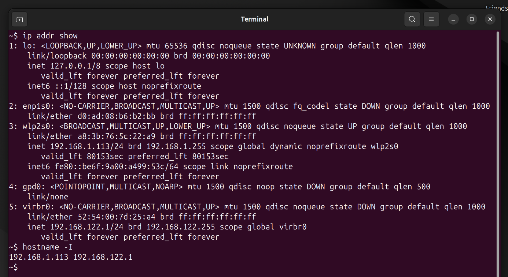
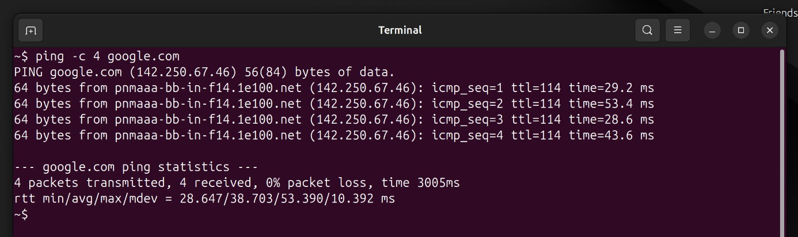
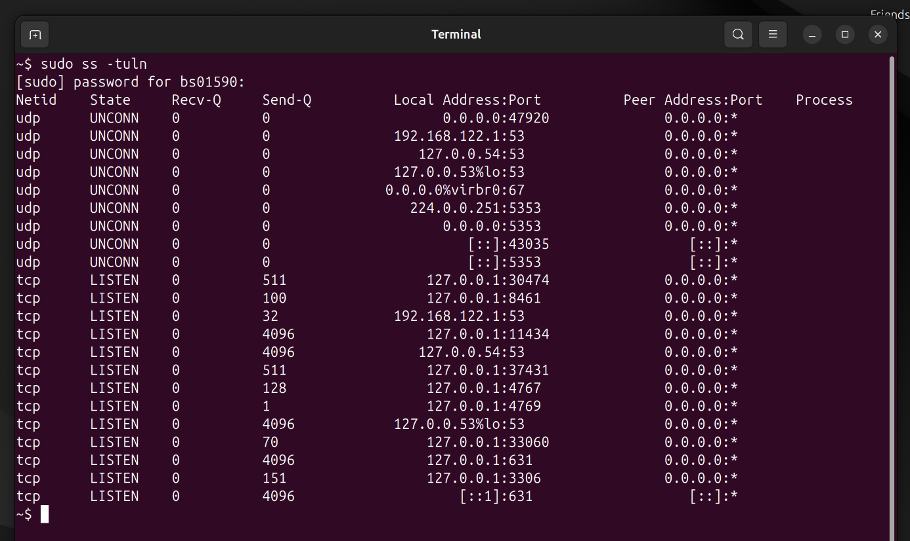

# Mini Project 8: Networking Basics

## Objective
Understand essential networking commands for system administration.

## Solution

### Step 1: Find System IP Address
I found my system's IP address using:

```bash
ip addr show
```

Alternatively, I could use:
```bash
hostname -I
```

This showed my local IP address on the network.

### Step 2: Check Connectivity to google.com
I tested internet connectivity by pinging Google:

```bash
ping -c 4 google.com
```

The `-c 4` flag sends exactly 4 packets and then stops. The response showed successful connectivity with latency times.

### Step 3: List Open Ports
I listed all open ports and listening services:

```bash
sudo ss -tuln
```

Or using the older command:
```bash
sudo netstat -tuln
```

The flags mean: `-t` (TCP), `-u` (UDP), `-l` (listening), `-n` (numeric)

### Step 4: Identify Process Using Port 22
I found which process is using SSH port 22:

```bash
sudo ss -tlnp | grep :22
```

Or:
```bash
sudo lsof -i :22
```

This showed the SSH daemon (sshd) listening on port 22.

## Screenshots

### Finding IP Address


### Ping Test to google.com


### Listing Open Ports



## Key Concepts Learned
- `ip`: Modern tool for network configuration
- `ping`: Tests network connectivity
- `ss`: Shows socket statistics and open ports
- `netstat`: Legacy tool for network statistics
- `lsof`: Lists open files and network connections
- Port 22 is the default SSH port
