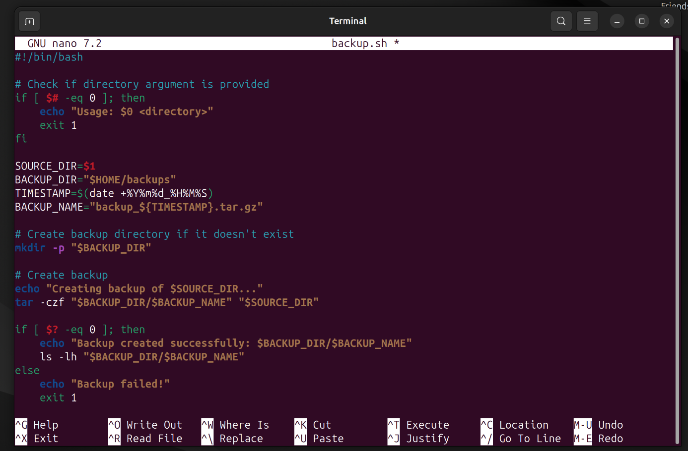
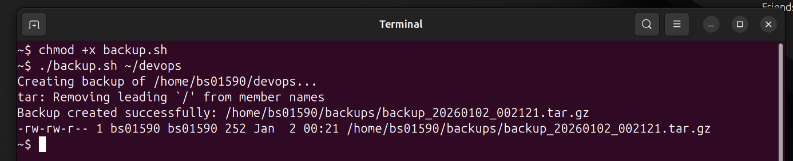
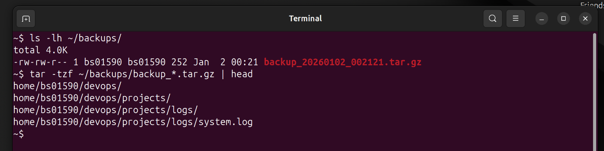

# Mini Project 9: Shell Scripting Basics

## Objective
Introduction to bash scripting and automation.

## Solution

### Step 1: Create backup.sh Script
I created a bash script for backing up directories:

```bash
#!/bin/bash

# Check if directory argument is provided
if [ $# -eq 0 ]; then
    echo "Usage: $0 <directory>"
    exit 1
fi

SOURCE_DIR=$1
BACKUP_DIR="$HOME/backups"
TIMESTAMP=$(date +%Y%m%d_%H%M%S)
BACKUP_NAME="backup_${TIMESTAMP}.tar.gz"

# Create backup directory if it doesn't exist
mkdir -p "$BACKUP_DIR"

# Create backup
echo "Creating backup of $SOURCE_DIR..."
tar -czf "$BACKUP_DIR/$BACKUP_NAME" "$SOURCE_DIR"

if [ $? -eq 0 ]; then
    echo "Backup created successfully: $BACKUP_DIR/$BACKUP_NAME"
    ls -lh "$BACKUP_DIR/$BACKUP_NAME"
else
    echo "Backup failed!"
    exit 1
fi
```

### Step 2: Make Script Executable
I changed the permissions to make the script executable:

```bash
chmod +x backup.sh
```

### Step 3: Run the Script
I tested the script by backing up a directory:

```bash
./backup.sh ~/devops
```

The script created a timestamped backup file in the ~/backups directory.

### Step 4: Verify Backup
I verified the backup was created successfully:

```bash
ls -lh ~/backups/
tar -tzf ~/backups/backup_*.tar.gz | head
```

The backup file was created with the correct timestamp and contained all files from the source directory.

## Screenshots

### Creating the Script


### Running the Script


### Verifying Backup


## Key Concepts Learned
- Shebang (`#!/bin/bash`): Specifies the script interpreter
- Variables: Store values for reuse
- Command substitution: `$(date)` executes commands and captures output
- Conditionals: `if` statements for error checking
- `chmod +x`: Makes files executable
- `tar`: Creates compressed archives
